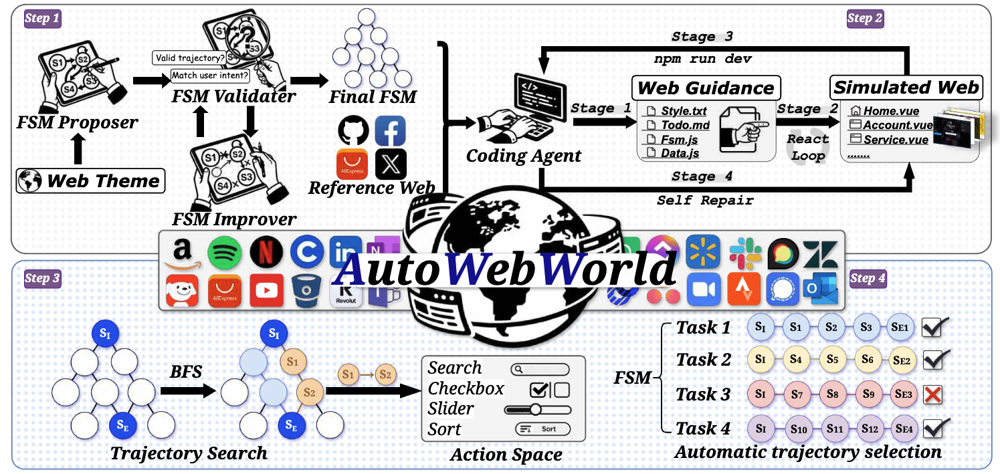

# AutoWebWorld

<div align="center">

[English](./README.md) | [简体中文](./README_zh.md)

</div>

## 📖 Introduction

<div align="center">
  
</div>

AutoWebWorld is an open-source framework for automated web application modeling, traversal, and intelligent agent training. This project provides a complete toolchain from Finite State Machine (FSM) generation to agent training, helping researchers and developers build and evaluate web automation agents.

## 📰 News
- **[2026-02-10]** 🚀 Added GRPO training module for vision-language model training
- **[2026-02-10]** 🔄 Completed BFS traversal module migration
- **[2026-02-10]** ✨ Completed FSM generator module migration
- **[2026-02-06]** 🎉 Project initialized, released v0.1.0

> 💡 **Tip**: Follow this project for the latest updates!

## ✨ Core Features

### 🎯 FSM Generation (`trajectory/fsm/`)
- **Automatic FSM Generation**: Use LLM to automatically generate Finite State Machines for web applications
- **Multi-level Complexity**: Support easy/medium/hard complexity configurations
- **Iterative Optimization**: Automatic validation and improvement to ensure FSM quality
- **Multi-model Support**: Compatible with GPT-5, Claude, Gemini, DeepSeek, etc.

### 🔄 BFS Traversal (`trajectory/bfs/`)
- **BFS Algorithm**: Generate all shortest paths using breadth-first search
- **Action Generation**: Generate concrete action sequences with parameters
- **FSM Normalization**: Standardize FSM structure for processing
- **Filter Mapping**: Advanced filtering and mapping utilities

### 🤖 Agent Training (`training/`)
- **GRPO Training**: Generalized Reward-based Policy Optimization for vision-language models
- **DeepSpeed Integration**: Efficient distributed training with Zero-3 optimization
- **Multi-GPU Support**: Scale training across multiple GPUs
- **Flexible Configuration**: Easy-to-customize training parameters

## 🚀 Quick Start

### Installation

```bash
git clone https://github.com/[your-username]/AutoWebWorld.git
cd AutoWebWorld
pip install -r requirements.txt
```

### Basic Usage

#### 1. Generate FSM
```python
import asyncio
from trajectory.fsm.generator import generate_perfect_fsm

async def main():
    fsm_data = await generate_perfect_fsm(
        theme="E-commerce Platform",
        model="gpt-5",
        target_score=100,
        output_dir="outputs/ecommerce"
    )
    print(f"Generated FSM with {len(fsm_data['states'])} states")

asyncio.run(main())
```

#### 2. BFS Traversal
```bash
# Normalize FSM
python -m trajectory.bfs.normalize --input fsm.json --output fsm_norm.json

# Generate action sequences
python -m trajectory.bfs.bfs_action \
    --fsm fsm.json \
    --norm fsm_norm.json \
    --out trajectories.json
```

#### 3. Train Agent with GRPO
```bash
# Prepare your data in data/train_data/
# - train.json: Training data
# - train_imgs/: Training images

# Run training
bash training/scripts/train.sh
```

## 📂 Project Structure

```
AutoWebWorld/
├── trajectory/              # Trajectory generation modules
│   ├── fsm/                # FSM generation
│   │   ├── generator/      # Core FSM generator
│   │   └── prompts/        # LLM prompt templates
│   └── bfs/                # BFS traversal
│       ├── bfs.py          # Core BFS algorithm
│       ├── bfs_action.py   # Action generation
│       └── normalize.py    # FSM normalization
├── training/               # Agent training modules
│   ├── grpo_train.py      # GRPO training script
│   ├── trainer/           # Trainer implementations
│   ├── configs/           # Training configurations
│   └── scripts/           # Training shell scripts
├── requirements.txt       # Python dependencies
└── README.md             # Project documentation
```

## 📚 Documentation

- [FSM Generator Documentation](./trajectory/fsm/README.md)
- [BFS Traversal Documentation](./trajectory/bfs/README.md)
- [Agent Training Documentation](./training/README.md)

## 🛠️ Tech Stack

### Core Dependencies
- **Python 3.8+**: Main programming language
- **Transformers**: Hugging Face transformers library for LLMs
- **DeepSpeed**: Distributed training optimization
- **TRL**: Transformer Reinforcement Learning library
- **OpenAI API**: For FSM generation (GPT-5, Claude, Gemini, DeepSeek)

### Training & Optimization
- **PyTorch**: Deep learning framework
- **Flash Attention 2**: Efficient attention mechanism
- **Liger Kernel**: Optimized kernels for training
- **Qwen-VL-Utils**: Utilities for Qwen vision-language models

## 📊 Example Applications

The project includes web application examples from multiple domains:
- E-commerce platforms (Amazon, AliExpress)
- Productivity tools (Asana, Notion)
- Social media (Discord, Twitter)
- Travel booking (Booking, Skyscanner)
- And more...

## 🚧 TODO List

### Upcoming Features
- [ ] **Evaluation Framework**: Comprehensive evaluation metrics and benchmarks for web automation agents
- [ ] **Web Examples**: Real-world web application examples and demonstrations

## 🤝 Contributing

Contributions are welcome! Please check [CONTRIBUTING.md](./CONTRIBUTING.md) for details.

## 📄 License

This project is licensed under the [MIT License](./LICENSE)

## 📧 Contact

- Project Homepage: [GitHub Link]
- Issue Tracker: [Issues Link]
- Email: [your-email]

## 📖 Citation

If this project helps your research, please cite:

```bibtex
@software{autowebworld2024,
  title={AutoWebWorld: An Open Framework for Web Automation and Agent Training},
  author={[Your Name]},
  year={2024},
  url={https://github.com/[your-username]/AutoWebWorld}
}
```

## 🙏 Acknowledgments

[People or projects to thank]