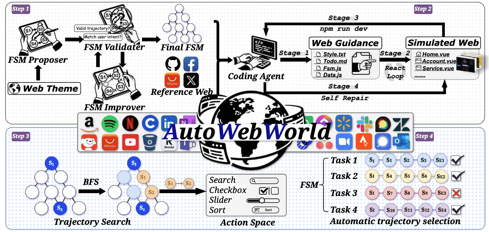

# AutoWebWorld

<div align="center">

[English](./README.md) | [简体中文](./README_zh.md)

</div>

## 📖 Introduction

<div align="center">
  
</div>

AutoWebWorld is an open-source framework for **automated web environment generation and GUI agent training**. Given a web application theme, it automatically generates a Finite State Machine (FSM) that encodes all pages, actions, and interaction logic — then compiles it into a running React web application, concrete trajectories via Playwright replay, and training data for vision-language agents.

The core insight: **data generation is a compilation problem, not an annotation problem**. The FSM is the single source of truth; everything else is derived from it.

## 🌍 Example Web Projects

We provide **29 pre-built web applications** ready to explore — browse them here: **[new_all_projects](./autowebworld/whole_pipeline/env_generator/data_augmentation/new_all_projects)**

To launch any project locally:

```bash
# Example: shopify
cd autowebworld/whole_pipeline/env_generator/data_augmentation/new_all_projects/Commerce_Finance/shopify/web
pnpm install
pnpm dev
```

The app will be available at `http://localhost:5173`.

## 📰 News

- **[2026-03-19]** Released the training data used in our paper: [HuggingFace Dataset](https://huggingface.co/datasets/Evanwu50020/travel_media_commerce_communication_productivity/settings)
- **[2026-03-18]** Added `autowebworld/` Web Synthesis module: FSM → React UI via multi-turn coding agent
- **[2026-02-10]** Added GRPO training module for vision-language model training
- **[2026-02-10]** Completed BFS traversal module
- **[2026-02-10]** Completed FSM generator module
- **[2026-02-06]** Project initialized, released v0.1.0

## 🏗️ Architecture

```
Theme Input  (e.g. "E-commerce Platform")
      │
      ▼
┌─────────────────────────────────────────┐
│  Layer 1: FSM Generation                │  trajectory/fsm/
│  LLM generates FSM → validate → improve │
└─────────────────────────┬───────────────┘
                          │  FSM (JSON)
          ┌───────────────┴───────────────┐
          ▼                               ▼
┌──────────────────────┐  ┌───────────────────────────────┐
│  Layer 2:            │  │  Layer 3: Web Synthesis        │
│  BFS Traversal       │  │  FSM → React/Vite web app      │
│  → abstract          │  │  via multi-turn coding agent   │
│    trajectories      │  └──────────────┬────────────────┘
└──────────┬───────────┘                 │
           │  abstract trajectories      │  running web app
           └──────────────┬─────────────┘
                          ▼
┌─────────────────────────────────────────┐
│  Layer 4: Trajectory Replay             │  autowebworld/whole_pipeline/
│  Playwright executes abstract           │
│  trajectories on live web app,          │
│  captures screenshots per step          │
└─────────────────────────┬───────────────┘
                          │  (screenshot, action) pairs
                          ▼
┌─────────────────────────────────────────┐
│  Layer 5: Agent Training                │  training/
│  GRPO on screenshots + action sequences │
└─────────────────────────────────────────┘
```

## ✨ Modules

### 🎯 Layer 1 — FSM Generation (`trajectory/fsm/`)

Generates high-quality Finite State Machines for web applications using LLMs. The pipeline runs in three steps: `FSMGeneratorAgent` produces 4–16 candidate FSMs in parallel, `FSMValidatorAgent` scores each one via BFS reachability analysis, and `FSMImproveAgent` iteratively refines the best candidate until the target score is reached.

Complexity is controlled by profiles in `trajectory/fsm/generator/profiles/`:
- **easy**: 10–15 pages, 3–5 actions/page, basic navigation
- **medium**: 15–25 pages, 4–6 actions/page, filters, permissions, search
- **hard**: 25–35 pages, 5–7 actions/page, multi-variant nav, interceptors

Each FSM encodes pages with a `signature_schema` (the data state), actions with `preconditions` and `effects`, and a `gui_procedure` specifying low-level browser operations (click, type, hover, drag).

```bash
# Run with default settings (medium profile, theme: blog_platform-medium)
bash trajectory/fsm/generator/run.sh

# Custom theme, output dir, concurrency, and profile
FSM_THEME="ecommerce-shopify" \
bash trajectory/fsm/generator/run.sh \
    trajectory/fsm/generator/outputs/my_fsm \
    16 \
    trajectory/fsm/generator/profiles/hard.json
```

### 🔄 Layer 2 — BFS Traversal (`trajectory/bfs/`)

Enumerates all valid interaction paths through the FSM and instantiates them as abstract trajectories. The FSM is first normalized into an edge-list format, then BFS runs from HOME to all terminal pages with deduplication by `(page_id, signature_hash)`. Placeholders like `{ITEM_ANY}` and `{search_query}` are filled in to produce executable action sequences. Filter combinations are enumerated separately via `split_filters.py`.

```bash
cd autowebworld/whole_pipeline/env_generator/bfs_generator

FSM=path/to/fsm.json

python split_filters.py --input $FSM            --output fsm_split.json
python normalize.py     --input fsm_split.json  --output fsm_norm.json
python bfs_action.py    --fsm fsm_split.json    --norm fsm_norm.json --out allshortest.json
python gui_mapping.py   --fsm fsm_split.json    --bfs allshortest.json --out bfs_mapping/
```

### 🌐 Layer 3 — Web Synthesis (`autowebworld/`)

Compiles an FSM into a runnable React/Vite web application using a multi-turn LLM coding agent. Starting from a base Vite+React template, `react_coding_agent.py` iteratively modifies the codebase to match the FSM, persisting its state across turns in `memory.json`. Generated apps are saved under `autowebworld/web_outputs/`.

```bash
# Set FSM path and run the coding agent
FSM_PATH=trajectory/fsm/generator/outputs/my_fsm/fsm.json \
bash autowebworld/run_react_coding_agent.sh
```

Key environment variables: `FSM_PATH`, `MODEL` (default: `gemini-3.1-pro-preview`), `MAX_TURNS` (default: 50), `OPENAI_API_KEY`.

### 🎬 Layer 4 — Trajectory Replay (`autowebworld/whole_pipeline/`)

Executes the abstract BFS trajectories on the live web application using Playwright, capturing screenshots at each step to produce concrete `(observation, action)` pairs as training data. Also handles item expansion (LLM-augmented mock data), visual query generation, and QA pair generation.

```bash
export OPENAI_API_KEY="your-key-here"

cd autowebworld/whole_pipeline
bash whole_run.sh
```

Configure which projects to run by editing `PROJECT_LISTS` at the top of `whole_run.sh`. Output is written to `whole_pipeline/new_outputs/<category>/<project>/`.

### 🤖 Layer 5 — Agent Training (`training/`)

Trains vision-language models on the collected trajectories using **GRPO** (Generalized Reward-based Policy Optimization). The default model is Qwen2VL, with reward functions for both answer accuracy and output format. Multi-GPU training is supported via DeepSpeed Zero-3.

```bash
# Place training data under data/train_data/:
#   train.json       — trajectory data
#   train_imgs/      — screenshot images

# Place base model checkpoint under models/Qwen2.5-VL-3B/

bash training/scripts/train.sh
```

## 🚀 Quick Start

### Prerequisites

```bash
# Clone and install Python dependencies
git clone https://github.com/your-username/AutoWebWorld.git
cd AutoWebWorld
pip install -r requirements.txt

# Install pnpm (required for web projects)
npm install -g pnpm

# Install Playwright browsers
playwright install chromium
```

### Run the Pipeline on Example Projects

The repository includes **29 pre-built web applications** across 5 domains, ready to run:

| Category | Projects |
|----------|----------|
| Commerce & Finance | aliexpress, JD_COM, klaviyo, revolut, shopify, walmart |
| Communication & Social | facebook, medium, microsoft_teams, outlook, quora, signal, slack, twitter, zoom |
| Media, Learning & Wellness | coursera, headspace, health, Spotify, tumblr, youtube |
| Productivity & Dev Ops | airtable, asana, bitbucket, freshdesk, github, onenote, Optimizely |
| Travel & Real Estate | skyscanner |

**Step 1 — Set your API key:**
```bash
export OPENAI_API_KEY="your-key-here"
```

**Step 2 — Choose a category.** Open `autowebworld/whole_pipeline/whole_run.sh` and set `PROJECT_LISTS`:

```bash
PROJECT_LISTS=(
    # "travel_real_estate_projects.txt"
    # "media_learning_wellness_projects.txt"
    # "commerce_finance_projects.txt"
    # "communication_social_projects.txt"
    "productivity_projects.txt"     # ← currently active
)
```

**Step 3 — Run:**
```bash
cd autowebworld/whole_pipeline
bash whole_run.sh
```

The pipeline processes each project through 6 stages: auto-patching components, screenshotting pages, BFS traversal and item expansion, Playwright trajectory replay, visual query generation, and QA pair generation. Output is written to `autowebworld/whole_pipeline/new_outputs/<category>/<project>/`.

## 📂 Project Structure

```
AutoWebWorld/
├── trajectory/
│   ├── fsm/
│   │   ├── generator/
│   │   │   ├── fsm.py                  # Orchestrator (generate → validate → improve)
│   │   │   ├── base_agent.py           # LLM agent base class
│   │   │   ├── fsm_generator_agent.py  # Initial FSM generation
│   │   │   ├── fsm_validator_agent.py  # Scoring and validation
│   │   │   ├── fsm_improve_agent.py    # Iterative refinement
│   │   │   ├── profiles/               # easy / medium / hard configs
│   │   │   └── run.sh                  # CLI entry point
│   │   └── prompts/                    # LLM prompt templates
│   └── bfs/
│       ├── bfs.py                      # Core BFS algorithm
│       ├── bfs_action.py               # Trajectory instantiation
│       ├── normalize.py                # FSM normalization
│       ├── gui_mapping.py              # Action → GUI operation mapping
│       └── split_filters.py            # Filter combination utilities
├── autowebworld/
│   ├── fsm_to_web_agent.py             # FSM → React app entry point
│   ├── react_coding_agent.py           # Multi-turn coding agent
│   ├── run_react_coding_agent.sh       # CLI entry point for web synthesis
│   ├── memory_store.py                 # Agent state persistence
│   ├── template/react_template/        # Base Vite+React template
│   ├── web_outputs/                    # Generated web applications
│   └── whole_pipeline/                 # Playwright replay + data augmentation
│       ├── whole_run.sh                # End-to-end pipeline entry point
│       ├── env_generator/              # BFS generator + data augmentation
│       └── web_extractor/              # Grounding extraction (Playwright)
├── training/
│   ├── grpo_train.py                   # GRPO training entry point
│   ├── trainer/                        # Custom GRPOTrainer
│   ├── scripts/train.sh                # Training entry point
│   └── configs/zero3.json              # DeepSpeed Zero-3 config
├── data/                               # Training data and outputs
├── requirements.txt
└── README.md
```

## 🛠️ Tech Stack

- **LLM APIs**: OpenAI-compatible endpoints (GPT, Claude, Gemini, DeepSeek)
- **Web**: React, Vite, Playwright
- **Training**: PyTorch, Transformers, TRL, DeepSpeed Zero-3
- **Optimization**: Flash Attention 2, Liger Kernel, bitsandbytes
- **Tracking**: Weights & Biases, TensorBoardX
- **Utilities**: Pydantic, PyYAML, Rich, python-dotenv

## 🚧 TODO

- [ ] Evaluation framework: benchmarks and metrics for web automation agents
- [x] Public dataset release: pre-generated FSMs and trajectories across domains
- [x] Release all websites used in the paper

## 🤝 Contributing

Contributions are welcome. Please open an issue first to discuss what you would like to change.

## 📄 License

[MIT License](./LICENSE)

## 📖 Citation

If this project helps your research, please cite:

```bibtex
@misc{wu2026autowebworldsynthesizinginfiniteverifiable,
      title={AutoWebWorld: Synthesizing Infinite Verifiable Web Environments via Finite State Machines},
      author={Yifan Wu and Yiran Peng and Yiyu Chen and Jianhao Ruan and Zijie Zhuang and Cheng Yang and Jiayi Zhang and Man Chen and Yenchi Tseng and Zhaoyang Yu and Liang Chen and Yuyao Zhai and Bang Liu and Chenglin Wu and Yuyu Luo},
      year={2026},
      eprint={2602.14296},
      archivePrefix={arXiv},
      primaryClass={cs.AI},
      url={https://arxiv.org/abs/2602.14296},
}
```
